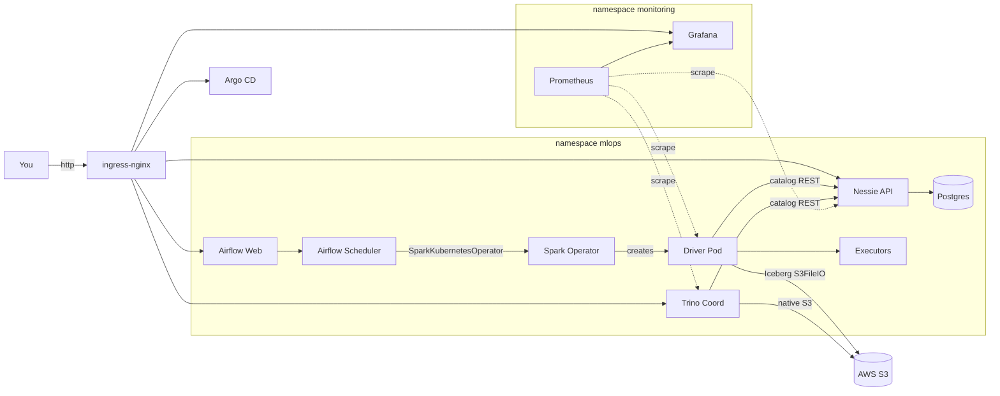
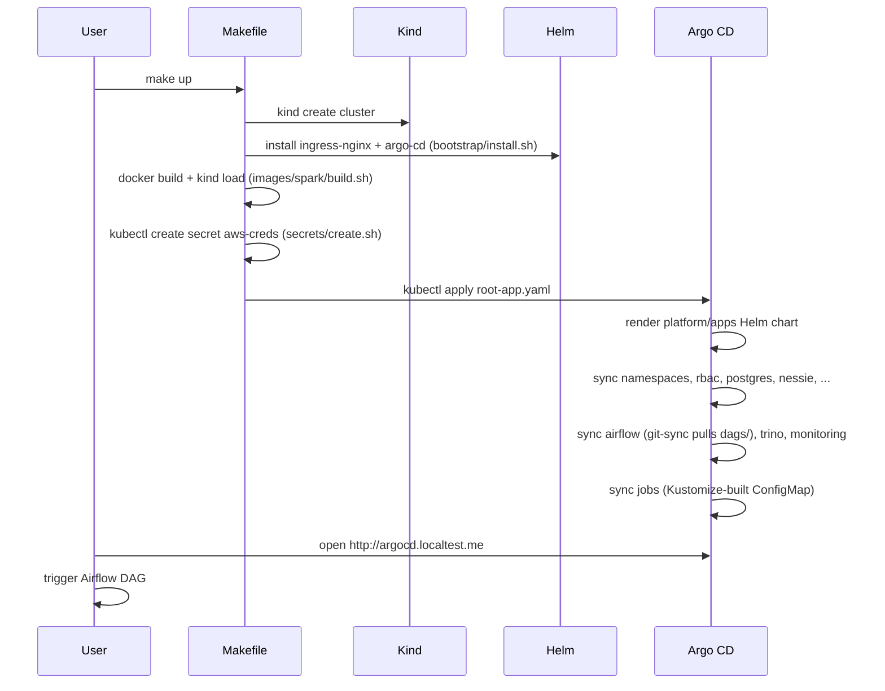

# Architecture

A production-near Iceberg lakehouse running on a local Kind cluster with the
same shape a real on-prem deployment would have:

- **Cluster**: Kind, 1 control-plane + 2 worker nodes, port 80/443 mapped
  to the host so ingress-nginx is reachable on `*.localtest.me`.
- **GitOps**: Argo CD applies and reconciles every component from this repo.
- **Catalog**: Project Nessie backed by Bitnami PostgreSQL.
- **Compute**: Kubeflow Spark Operator runs SparkApplications. Image is a
  custom build of `apache/spark:3.5.6` with Iceberg + AWS jars baked in.
- **Orchestration**: Apache Airflow with `KubernetesExecutor`, DAGs synced
  from this repo, jobs submitted via `SparkKubernetesOperator`.
- **Query**: Trino with the iceberg connector + native S3 filesystem.
- **Storage**: AWS S3.
- **Observability**: kube-prometheus-stack (Prometheus + Grafana + Alertmanager).

## Component diagram



## Bring-up sequence



## Folder map

```
.
|-- Makefile                       # entrypoint targets
|-- README.md
|-- .env.example
|-- cluster/kind.yaml              # 1cp + 2w, hostPort 80/443
|-- bootstrap/                     # before-Argo cluster infra
|   |-- install.sh                 # helm-installs ingress-nginx + argo-cd
|   |-- ingress-nginx/values.yaml
|   |-- argocd/values.yaml
|   |-- argocd/root-app.yaml       # envsubsted by argocd-sync.sh
|   `-- argocd-sync.sh
|-- platform/                      # everything Argo CD owns
|   |-- namespaces.yaml
|   |-- rbac/
|   |   |-- spark-driver.yaml      # SA + Role for driver pods
|   |   `-- airflow-spark.yaml     # SA + Role for Airflow workers/scheduler
|   |-- apps/                      # app-of-apps Helm chart
|   |   |-- Chart.yaml
|   |   |-- values.yaml
|   |   `-- templates/             # one Application CR per component
|   |-- postgres/values.yaml
|   |-- nessie/values.yaml
|   |-- spark-operator/values.yaml
|   |-- airflow/values.yaml
|   |-- trino/values.yaml
|   `-- monitoring/values.yaml
|-- images/spark/                  # custom Spark image
|   |-- Dockerfile
|   `-- build.sh                   # docker build + kind load
|-- jobs/                          # SparkApplication templates + their code
|   `-- iceberg-write/
|       |-- iceberg_demo.py        # SOURCE OF TRUTH for the Spark code
|       |-- kustomization.yaml     # generates iceberg-demo-app ConfigMap
|       `-- sparkapplication.yaml  # submitted by Airflow's DAG, NOT by Argo
|-- dags/                          # git-synced into Airflow
|   `-- iceberg_sparkapplication_demo.py
|-- secrets/                       # gitignored
|   |-- aws-creds.env.example
|   |-- grafana-admin.env.example
|   |-- create.sh
|   `-- README.md
|-- scripts/smoke.sh               # end-to-end test
`-- docs/architecture.md           # you are here
```

## Why these choices

- **Kind over Minikube/Docker Desktop k8s**: faster, multi-node out of the
  box, the same image you'd run in CI.
- **Argo CD over plain `helm install`**: gives you drift detection, a UI,
  rollbacks, and `kubectl apply -k` doesn't tell you when reality diverged
  from git. Also matches what the user asked for in "company on-prem".
- **App-of-apps as a Helm chart**: lets Argo manage even the sub-Application
  CRs (full self-service GitOps), while still parameterising repoURL/branch.
- **Custom Spark image instead of `spec.deps.packages`**: removes the most
  common failure mode (missing/changed image tag, Maven download race, Ivy
  cache permission errors). Image rebuild is cheap; runtime classpath surprises
  are not.
- **Iceberg `S3FileIO` instead of Hadoop S3A**: native, faster, and supports
  the same path scheme Trino's native-s3 reader uses.
- **`SparkKubernetesOperator` instead of `kubectl-in-a-pod`**: typed, has a
  matching sensor for status, and uses the cluster's own RBAC.
- **kube-prometheus-stack**: out-of-the-box dashboards for k8s + GPU + node
  state, plus the ServiceMonitor CRD we use to scrape every component.
- **`*.localtest.me` instead of `port-forward` chains**: every URL in the
  README is real, copy-paste, and works without an extra terminal.
